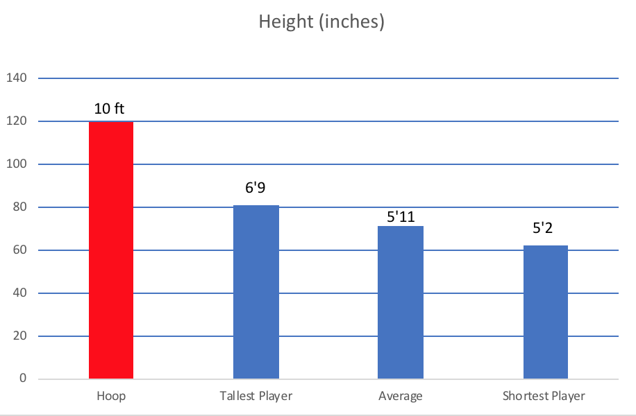
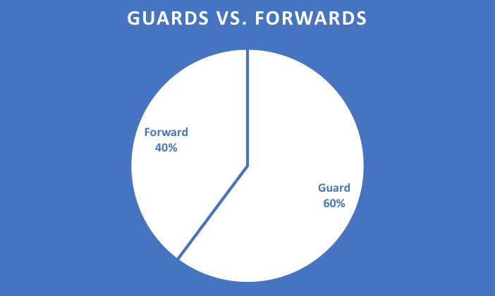

Girls scattered in gyms across the country are playing basketball dreaming about becoming a Division I athlete. That dream came true for the 14 women on The American University basketball team. 

<iframe src="https://www.google.com/maps/d/embed?mid=1FlFwcD2f6DgI7v1zSp6ijlcKINZtVdYg" width="640" height="480"></iframe>

For some girls the recruiting process begins as young as 12 or 13-years-old. For others the process picks up around 16 or 17-years-old. For those who aren't firmiliar with the recruitng process of WBB basketball very simplified version goes like this. 

Before your junior year of high school college coaches cannot contact you in any way other than a questionnaire. This should not scare you away from emailing or calling them. On September 1 of a recruits junior year of high school, college coaches can begin contacting them. Most recruits attending top level schools sign a National Letter of Intent on November 11 of their senior year. 

American University basketball star Cecily Carl began the recruitment process at the age of 15 towards the end of her freshman year of high school. 
"The recruiting process was difficult for me because I put a lot of pressure on myself and when i didn’t feel like i was doing well enough it was very tough," said Carl. 

The recruiting process is different for everyone. For some it can be stressfull which makes sense considering these girls are making a decision that can impact the rest of their life before some of them can even drive.

 "I also had a good deal of anxiety before playing major tournaments but it was a good amount of nerves," said Carl. The major tournaments she speaks of are playe during NCAA sanctioned recruiting time periods. These weekends happen in April, July and September. The map below depicts the geopgraphy of players that are from the United States and are currently on the roster of a Top 50 RPI NCAA Division I school.

<iframe id="datawrapper-chart-kt9ao" src="https://datawrapper.dwcdn.net/kt9ao/1/" scrolling="no" frameborder="0" allowtransparency="true" style="width: 0; min-width: 100% !important;" height="400"></iframe>

There are 349 Division I women's basketball programs in America. The ratings percentage index (RPI) which more easily translates as the ranking of teams according to their record and level of competition. The above map shows the hometown of all 656 players from the 2017-18 season. 

American University head women's basketball coach, Megan Gebbia, said there is bias when recruiting based on location. 

"My feeling is that there are pockets across the United States where you will see a certain style of play and certain type of players. However there are always outliers in every area that go against what you would expect." She continued, "I tend to recruit more in the midwest because I think they spend time on the fundamentals and may have better youth development leagues and coaches."

The larger more popular AUU tournaments are held in big cities such as Portland, Ore., Chicago, Ill., Orlando, Fla., Atlanta, Ga. and Washington, D.C. The map shows that players from those areas specifically the midwest to the east coast, make-up the majority of NCAA women's basketball players. 

Style of play can vary by region and can determine the level and type of school that recruits in a certain area. "I think that some girls that I played with who were actually from Harrisburg play faster paced basketball compared to me and other people on my team who were from small towns. Also, girls from Maryland and New Jersey seemed to play with more physicality and aggression," said Cecily Carl who is from Mechanicsburg, Pa. which has a population of 9,000 people. 

Carl, the reigning Patriot League Tounrament MVP, went on to explain the difficulties of the recruiting process including that she had to travel to bigger cities for tournaments and believes the recruiting process can be improved for future athletes. "I think coaches just need to be a little more understanding that it’s very overwhelming for high school kids to deal with a bunch of people talking to them and expecting them to decide, at 16 or 17, what they are going to want their lives to be like when they’re 21 and 22." 

There are about 430,000 girls make up the basktball rosters of high schools across the nation. Only 17,000 of those girls will join the roster of a NCAA women's basketball program. That means there is less than a 4 percent chance of becoming a collegiate basketball player. Of that percentage only 4 percent will play for a top 50 program. 

Coach Gebbia had three pieces of advice on how to increase the probability of joining a top basketball program. 

The first,"For the players that come from small towns and rural areas it is difficult to get the exposure sometimes. I would try out for the best AAU program in your state or adjoining states." 

AAU teams travel across the country to play in NCAA santioned tournaments that college coaches come to recruit at. 

The second, "I would also suggest going to elite camps at the schools you are interested in." 

Elite camps allow for coaches and players to interact with recruits which could lead to further conversation and even the coach coming out to see you play. 

The third, "Finally, contact the coaching staff either yourself or through your high school/AAU coach and have them send film." 

Most coaches don't make scholarship offers after only watching film. 
However, it is a great way to get on the recruiting board and can lead further recruitment. 

Even with all of the advice in the world there are two things that can't be taught in basketball. The first is heart. Either kids love the game or they don't. The second is height. There is no changing genetics.

----

The average height of a women's basketball player is 5'11". The tallest active player is Felicia Aiyeotan. Standing at 6 feet 9 inches Aiyeotan is from Lagos, Nigeria and is currently a junior at The University of Virginia. 

The shortest active player is Jessica Laemmle. Standing at 5 feet 2 inches Laemmle is from Louisville, Kentucky and is currently a freshman at The University of Louisville.

The five players on the court are usually made up of three guards and two forwards. Therefore it makes sense that 60 percent of current athletes are listed as guards. It also can be inferred to mean that forwards are rare, so if you've got some height go pick up a ball and maybe you'll get a scholarship for it. It is also a reflection of transformation of basketball. Players like Steph Curry and Klay Thompson have revolutionized how basketball is played on all levels. Everyone one wants to be a guard because guards get to stand on the three-point-line and fire away. 
        
"Being recruited as a guard you really have to make yourself stand out. Whether you excel in ball handling, have stellar defense, shoot the 3 at a consistent high percentage, or you can do it all. You can’t just be average at something, whatever specific talent you have, you have to make sure that skill sets you apart from other who have the same skill," said Indeya Sanders, American University freshman guard.