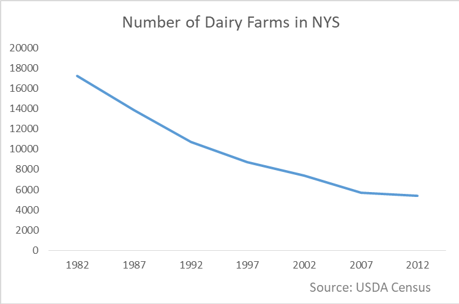
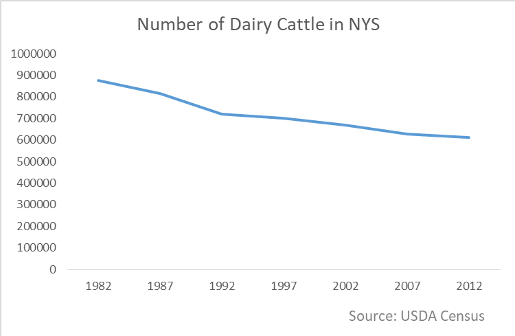
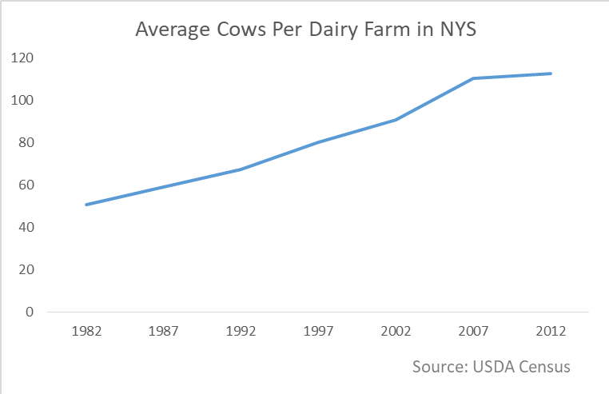
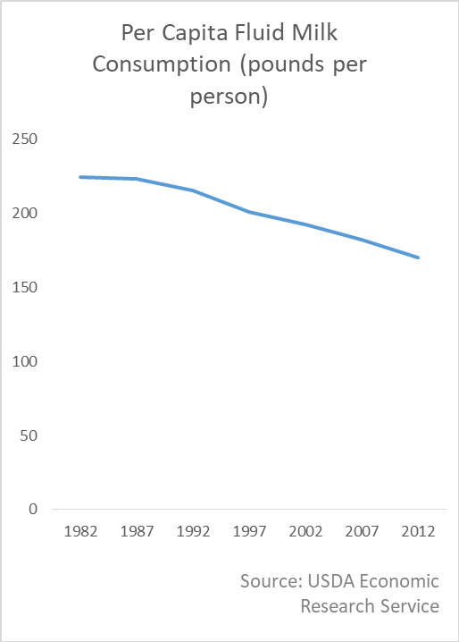
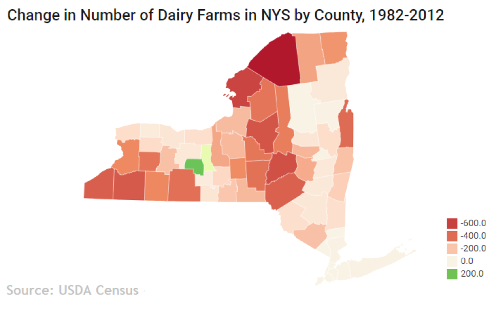

In a state where dairy sales represent half of all agricultural sales every year, farmers are struggling to stay afloat. From 1982 to 2012, New York State has gone from 17,236 individual dairy farms down to only 5,427 farms. In just a thirty year period, more than two-thirds of the state’s dairies have gone out of business.

This trend won’t come as a complete surprise to most residents of the state, though. After all, who hasn’t seen old farmlands sold off and developed into housing developments or new businesses? It’s a fate that many communities have witnessed over the past decades.

The New York Times recently reported that this decline in dairy farms has resulted in another alarming trend—a string of suicides by dairy farmers with no other options than to take their lives so their families receive their life insurance payouts. These incidences are extreme cases and by no means the norm, but they do demonstrate a very real and pressing economic hardship faced by the state’s remaining dairy farmers.

There’s no one cause of this trend, but decreasing number of farms also coincides with a declining consumer demand for dairy as well as increasing competition from larger farms that have consolidated from the remnants of older ones, according to the same New York Times article.

After all, while the number of dairy cows in the state has also declined, it has done so much less sharply than the number of farms.

*A loss of revenue has resulted in a major decline in dairies in the state.*

*Not all farms have suffered, though—a lucky few large ones have been able to survive the hard times and even grow their herds and their revenue.*

*The average number of cows per dairy farm has risen steadily over these three decades, from around 51 cows per farm in 1982 to around 113 cows per farm in 2012. 113 cows isn’t an extraordinarily large farm, but this trend does suggest that the remaining farms are growing. *

## Hard work, little reward

New York native Pete Maslyn has been involved in the dairy industry in one way or another for his entire life. Although he grew up on a smaller family farm and owned his own herd with his wife, volatile milk prices in the early 2000s meant that he had to lease out most of his cows and go to work at a much larger dairy. He now works at Hemdale Farms, a dairy of 1250 cows based in Seneca Castle, New York.

Maslyn said that one of the biggest disadvantages that owners of small farms have is always being tied to their farm. Without the budget to hire any employees outside of the family, they work their own farms every day, 365 days a year.

“So if you don't love what you are doing,” Maslyn said, “it's going to wear you down over time.”

He also said that smaller farms have the economic disadvantage of not having much equity to borrow against in years when milk prices are low and no profit can be made. Although farms with some debt can still compete, the lack of cash flow means that these farms are often lost as farmers age and eventually retire without enough cash flow to realistically bring a son or daughter, and thus a new generation, into the business.

Large farms, on the other hand, have more money to purchase inputs like feed and machinery, and also can buy these items in larger volumes to save money. They also can offer higher wages and incentives like vacation time to employees. In general, large farms have more saved up and can afford the latest advancements that can help them produce more milk. In years when the milk prices aren’t so conducive to making a profit, they can generally survive. 

## A declining demand 

Prices can make or break success for a small farm that has few resources, then, so years with extraordinarily low milk prices can force many farms out of business. 

When I asked Maslyn what sort of trends he thinks may be contributing to low milk prices, he had a very clear answer: “People are drinking less milk!

*Milk consumption has been steadily declining. *

According to the New York Times, the federal government determines milk prices each year, and has lowered them due to a combination of high milk production (due to advances in milking technology) and low consumer demand. And it’s true: consumption of liquid milk has certainly declined in the past few decades.

Maslyn said that he believes confusing labeling in grocery stores may be a major reason for this. Increasingly health-conscious consumers keep an eye out for buzzwords that suggest products might be more environmentally friendly or healthy.

I spoke with Jerry Cessna, an economist from the Department of Agriculture, who spoke about a potential cause for the decline of milk consumption. 

“We know that demand for plant-based milk analogs has been rising,” said Cessna. “However, we haven’t analyzed the extent to which these products substitute for milk.”

So although we can’t say for certain that the rise of non-dairy alternatives like soy milk and almond milk has directly caused the decline in milk sales, there certainly is a correlation. And as milk sales have gone down, the government has lowered the prices that farmers can get in return for their product.

This causes other problems down the line in the industry. Another obstacle to farms is the fact that dairy cooperatives, to which farmers sell their milk, are also wary of the current economic situation. 

“Most milk cooperatives are not taking any new producers and some are setting limits as to how much their farms can produce,” said Maslyn. 

This means that even if farms are able to increase their output, they may still not be able to sell that milk and gain more revenue. This isn’t particularly motivating, especially for farmers in increasing amounts of debt who are now seeing the advantages of selling their family farms. 

## A changing landscape

Certainly, what can’t be disputed is that the landscape of the state is changing.

*Over this thirty year period, only two counties in the state experienced an increase in number of dairy farms. Most counties experienced a decrease, including ones as drastic as a loss of 796 farms, which occurred in St. Lawrence County. *

“Some farmers can get a higher price for their farmland by selling building lots for houses than selling to another farmer,” said Maslyn. 
This results in a gradual suburban sprawl as old farmlands are transformed into a new and different landscape, and whether this is a good or bad thing is up to debate. After all, we are slowly losing a landscape that has defined rural New York for the past few centuries. 

Then again, maybe a nostalgia for that lost past is counterproductive. The farms that do remain, though less in number, are much more efficient than they were in the past. A decline in the popularity in milk also opens up new potential for agricultural industries that grow the plants used in milk alternatives.

What this means is that our communities look very different than they used to, and trends suggest that they will continue to change. 

Maslyn, however, remains optimistic about the future of dairy farming in the state.

“Overall, I think smaller farms can still make it in New York,” he said. “It has never been an occupation of choice for anyone faint of heart, and it never will be, but if it is the life a family commits themselves to it can still be very rewarding.”

So despite the declining popularity of milk and a slew of other hardships, it looks like our state’s dairy farmers plan to keep working at it ‘til the cows come home.

