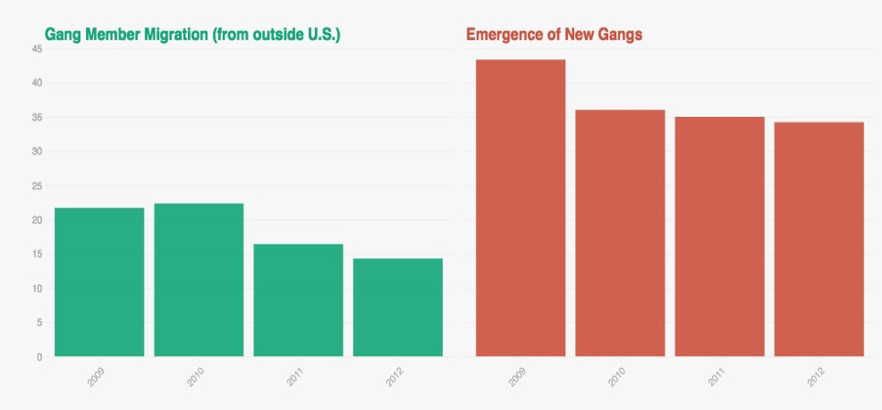
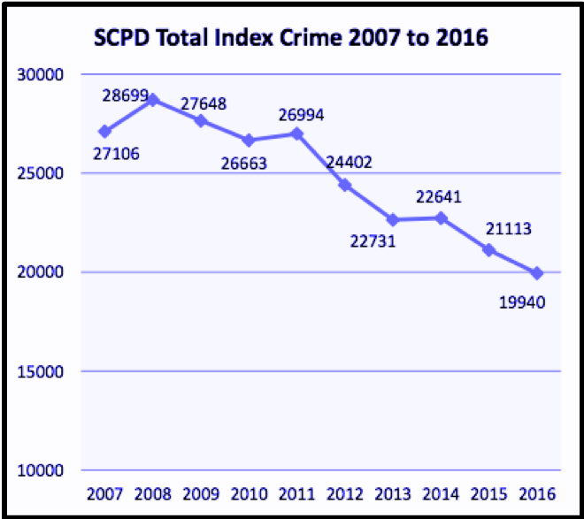
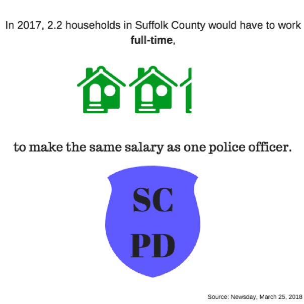
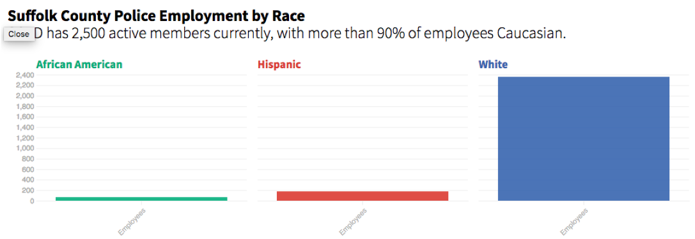

WASHINGTON-- Suffolk County announced record low crime rates during the first quarter of 2018. At the same time, Governor Cuomo approved $18 million for gang violence prevention on Long Island in the 2019 budget.

When President Donald Trump visited Brentwood during the summer of 2017, he spoke to a crowd of law enforcement officials and vowed to end MS-13 violence on Long Island. He described Long Island communities as “blood-stained killing fields” that are “under siege,” although some Long Island residents refuted his claim, including long-time resident Lisa Semivli.

Despite Trump’s worrisome rhetoric, the emergence of new gangs showed a slow decline from 2009 to 2012, and the number of gang-affiliated migrants entering the United States is even lower.

*Source: National Gang Center. [National Youth Gang Survey Analysis](http://www.nationalgangcenter.gov/Survey-Analysis).*

When looking at Suffolk County, President Trump’s claim about Long Island is still misleading. From 2009 to 2016, the total index crime, or overall crime rates, steadily declined. In the first quarter report of 2018, violent crime rates fell by more than 18 percent in Suffolk County, such as homicide, rape, and robbery. More drastically, gun violence fell by 49 percent.

*Source: Suffolk County Police Department, 2018*

Despite the steadily declining crime rates, Suffolk County Police associated more than a dozen homicides with the El Salvadoran gang MS-13 since January 2016. Of those cases, [Brentwood](https://cis.org/Report/Brentwood-NY-Consumed-MS13-Crime-Wave) saw nine murders, along with one attempted murder , and one rape of a teenager by the gang MS13 in 2016.  
It’s unclear whether those arrested on suspicion of gang activity are identified through a specific gang marker or through detectives’ discretion.

Governor Cuomo made [criminal justice reform](https://www.ny.gov/programs/criminal-justice-reform-0) a focal point of his career. Since taking office, he pardoned 174 people. Last month, he announced a pro-bono legal service for immigrants in New York, combining volunteer lawyers with faith-based organizations.

The program announced by Cuomo in April did not include funding for community outreach through faith-based organizations, although he did emphasize last month that this initiative would focus on preventative measures. 

Since Cuomo’s gubernatorial opponent, Cynthia Nixon (D-NY) announced her candidacy, she’s consistently attacked Cuomo for not being progressive enough. She was recently critical of the governor for not pursuing legislation to establish the entire state as a “sanctuary state.”
Following that attack, Cuomo [responded](http://www.nydailynews.com/news/politics/cynthia-nixon-vows-new-york-sanctuary-state-article-1.3917568), “I think we have the most progressive record in the country in this state.”

He added that the $2 million for local law enforcement aid was for officers who already have a “difficult job.” Ms. Simivli argued that amount of money could be used better elsewhere.

Suffolk County Police officers have historically been paid the highest out of all 62 counties in New York, however, Newsday found that nearly 1,000 employees in 2017 received a [minimum salary](https://www.newsday.com/long-island/politics/suffolk-county-salary-200-000-nassau-1.17655983) of $200,000. That’s roughly the equivalent of 2,166 households working full-time last year, keeping in mind one household includes two full-time workers.

Semivli said minority communities are also concerned about becoming a police state, where they may be “targeted.” She’s referring to Cuomo’s recent objections to ICE arrests throughout New York, where more than 200 “suspected undocumented immigrants.”

“The police department in Suffolk is 2,500 active police, with only 65 being African American and 175 Latino,” said Semivli. “I think a minimum to be recruited for SCPD should be an Associate's Degree also,” she added.
Both the African American and Hispanic communities are heavily underrepresented in local law enforcement. Ms. Semivli said she’d like to see an increase in diversity within SCPD, and the establishment of a diversity quota system within Suffolk County schools.

“I don’t feel safe for my children or grandson because we are people of color. I feel that gangs are the result of a community forgetting about its youth and throwing them away,” said Semivli.

Involved with Parent-Teacher Associations and community-based organizations, Semivli argued there needed to be more focus on keeping kids out of gangs so that they are not “threatened into joining.”

With the current debate on police salaries and the battle against MS-13, Semivli said she felt hopeful that the extra funding will be used in good faith. “Do I believe there is gang violence a problem on Long Island? Honestly, there is a problem for people of color being disenfranchised, where the children are forgotten by the government,” said Semivli. 
She added that the government should provide “positive peer mentoring and community projects to make all people feel safe.”

To ease community relations, Suffolk County Police announced a list of community meetings leading up to June. Semivli pointed out that some of the meetings aren’t actually in their precincts. “I called up headquarters in Yaphank, and was told that each individual precinct decides where community meetings are held,” she said. 

In minority communities, locations for the meetings were scheduled within the precincts. This was not the case for predominantly white communities like the First and Fourth precincts, where meetings are scheduled to take place in local libraries. Semivli argued the lack of policy is discriminatory.

When Cuomo first announced the anti-gang spending package on March 30, he claimed $16 million would go towards reaching at-risk youth. Two weeks later, on April 11, Cuomo announced an additional $2 million in the package to go towards aid for law enforcement on Long Island. 

Despite historically low crime rates, Suffolk County Police Department is expecting additional funding in 2019. MS-13 violence on Long Island is an issue, however, Long Islanders like Semivli are unhappy with the amount of money spent on law enforcement. The governor’s office could not be reached for comment.

