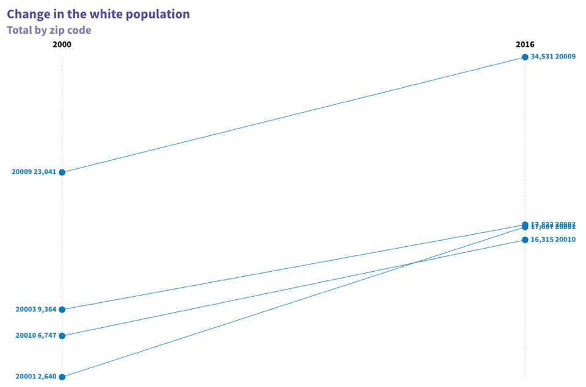
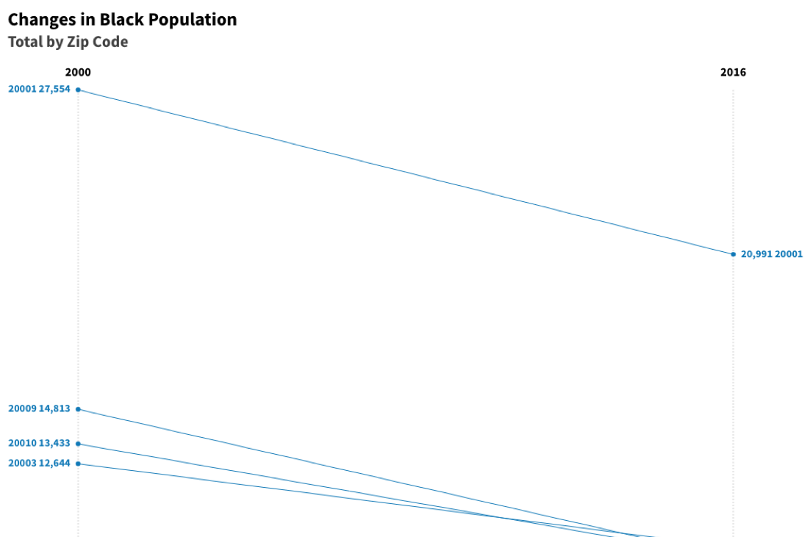
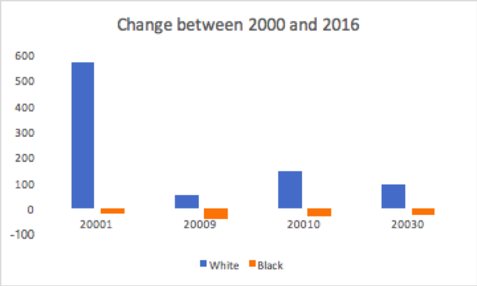
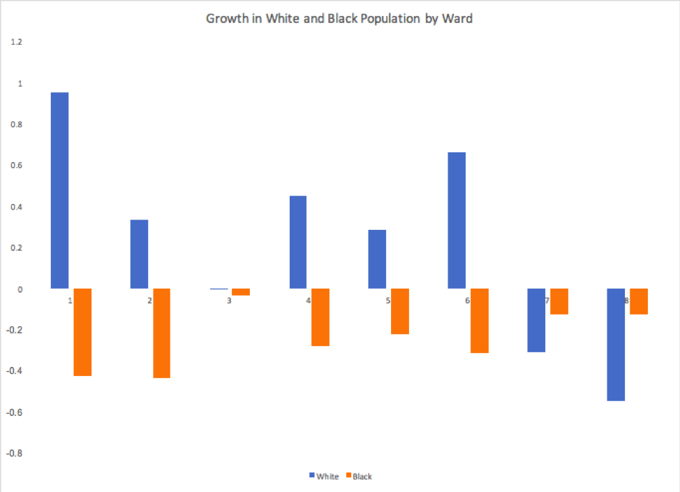

The District of Columbia is currently experiencing an economic boom unlike any other in its history; but is it leaving long-time residents behind?

Trena Taylor was born and raised in Shaw, much like most native Washingtonians, she grew up in a two story colorful walk up townhouse on Bates street. She had gone to Dunbar High School, only 5 blocks away,  and graduated from there in the early eighties. Now, like many of her neighbors, she can no longer afford to live in the same house she grew up in, much less the same neighborhood. That’s because Shaw, which includes a part of the U street corridor, has gone from being known as the “black broadway” to the epicenter of gentrification and the affordable housing crisis in Washington, D.C.
	
“It's not the same; it feels like a different country.” Taylor tells me. The block where she grew up, was once filled with mom and pop owned shops and dinners. Where once middle class African-Americans could afford to live there, the area has now become one of the trendiest neighborhoods for young urban professionals. As a result, long-term residents have been displaced, many moving East of the River, into deep Northeast, Prince George county, Maryland, or even farther afield to Pennsylvania or North Carolina. 
	
Taylor’s reason for leaving mirror these concerns. “The rent went up too much,” she says. Average rent prices had gone up by 3 percent year since 2000, in a city where units that are federally subsidized or built after 1975 are not eligible for rent-control. 
	
But that’s not the only reason she left. “They treat like your less, like a second class citizen,” she said of the newcomers. Between the economic concerns, and the feeling of not belonging, the incentive for long-term African American residents to remain in the area is not there anymore.

Harlem Renaissance poet Langston Hughes once wrote “I tried to write poems like the sad songs on Seventh Street” as he would listen to them in LeDroit park. Today, walking down around 7th and U,  one is more likely to find high-end condominiums, where rents start at $1,700, chic coffee shops and upscale restaurants than the sad songs that inspired Hughes.

This is because of the mass demographic change that Shaw has gone through. When Taylor was growing up in Shaw in the early 80’s it was a predominantly black, as the neighborhood went through one of the worst crime waves in the history of the city. However, by the turn of the century, as the city became safer and high-paying jobs moved back to the city from the Northern Virginia suburbs, things started to change.
Many developers, such as those of the Avalon, which owns three  residential buildings in D.C., claims that these concerns are outweighed by the benefites. According to them, many of the owners simply cashed out, and accepted the lump sums offered for homes which were once purchased at a fraction of the price. 

In the 20001 zip code, which covers most of Shaw and Bloomingdale, another adjacent neighborhood, along with a couple blocks downtown, the demographics went through a massive shift in the 2000s, a change that would leave the area looking very differently today.

As more and more relatively wealthy white transplants moved in, incomes rose, so did rent and home prices. Today these neighborhoods look very differently than what they did 15 years ago. 

All Data from the Census bureau, censusreporter.org 

In 20001, the percentage of white people relative to black people living in the area shot up 9% to 46% in 2016. In 20009, which covers most of Adams Morgan, Columbia Heights and Meridian Hill Park, the amount of white people grew to 80%. In 20010, which covers Mount Pleasant and Park View, it doubled to 2/3rds of the population. And finally in 20003, Navy Yard and Capitol, the few parts of Southeast not east of the Anacostia river, whites also became the majority after doubling their size.

In all four of these zip codes, the white population grew substantially while the black population either stagnated or went down. 

This racial displacement has resulted in D.C. becoming one of the most segregated and unequal cities in America. The results are staggering: Ward 3, located entirely in Northwest, is 74 percent white and 6 percent black, the median income in is $112,000, the  86 percent of residents have a bachelor’s degree. Meanwhile, Ward 8, is 92 percent black and four percent white, the median income stands at $31,000 and only 14% have a bachelor’s degree. As such, the boom in the population has affected the groups differently 

*From the District of Columbia Office of Planning.and census bureau.*

While the white population had grown in all wards except 7 & 8, the black population declined in all wards between 1990 and 2010. This reflects that even the wards East of the River are becoming too expensive for the districts long-term residents. 

According to Anabelle Martinez of the Central American Resource Center, an immigration and housing advocacy group based in Columbia Heights, this in part is why the problem is hard for many people to understand. “When you directly benefit from something, it's hard to see its downside,” she says. “Most people who move here don’t see the spaces where they are renting as places where people have lived for 10, 15, 20 years, but rather just a temporary home for yourself.”

Many of the clients at the center are Latino immigrants, mainly from El Salvador, who came to D.C. during the eighties. Many of them settled in the Mount Pleasant/Columbia Heights area, opening Spanish-language Catholic Churches, pupuserias, and grocery stores stocked with imports from their home countries.

The city will claim that the influx of relatively wealthy newcomers has led to a new tax base, which fills the coffers that pays for new services, a competent police force, and glitzy new public libraries and recreation centers. Developers say that rising home prices in the city have led to many older people cashing in on their homes and moving to the suburbs.
But for people Taylor and the clients of the Central American Resource Center, those are hollow words.

