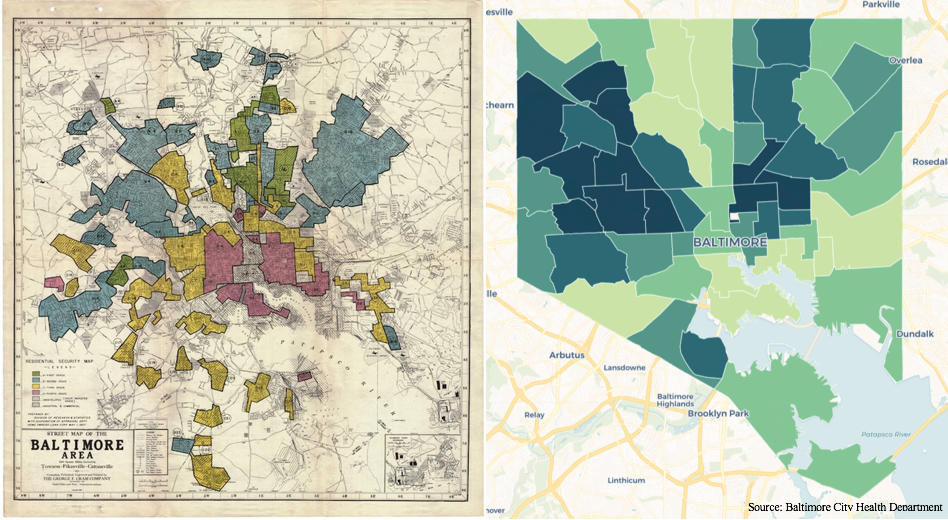
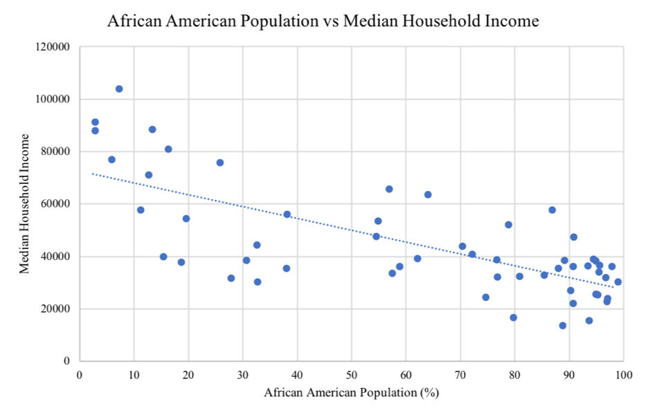
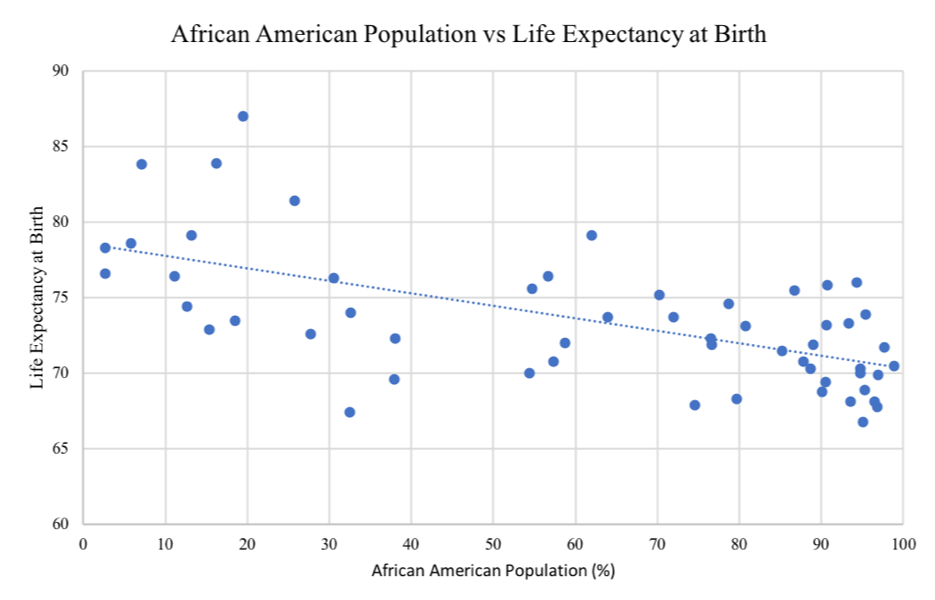

The ability to purchase and consume fresh and healthy foods is often taken for granted.  In the United States, millions of people in low-income, minority, and/or rural areas live in food deserts, which the Centers for Disease Control and Prevention defines as “areas that lack access to affordable fruits, vegetables, whole grains, low-fat milk, and other foods that make up a full and healthy diet.”  Baltimore, Maryland is no exception.  Past discriminatory policies such as redlining have continued to perpetuate disparities in health and wealth.  Food deserts in Baltimore disproportionately affect low-income people of color who, because of shortages in healthy food options, suffer the indirect and direct consequences and continue to live in a cycle of poor health and poverty.

Johns Hopkins recently concluded that, in Baltimore city, 146,077 residents or 23.5 percent of residents, live in food deserts.  Of this population, 124,521 are African American.

In 1934, the Federal Housing Administration (FHA), created by the Federal Housing Act of 1934, introduced the discriminatory and unethical practice of “redlining.”  Between 1934 and 1968, the FHA would assess neighborhoods, issuing grades between A (green) and D (red) and consistently rating the neighborhoods with African Americans as lower grades.  African Americans and residents of these redlined districts were explicitly refused mortgage loans, among other financial services, by the FHA.  This discrimination decreased the values of homes in low-graded areas and drove away businesses and wealthy and/or white individuals.  Despite being deemed illegal and unethical, redlining continues to affect African Americans today as many face the repercussions of family and neighborhoods being “D-rated” nearly a century ago.  Below is the 1937 Residential Security Map of Baltimore city paired with a 2017 Map of African American populations in Baltimore city.  The 2017 map is broken down by “community statistical areas,” clusters of neighborhoods zoned by the city government to better gather data associated to population health.

1937 | 2017

Admitting some movement within the African American population, much of the pattern remains.  Throughout the years, this discrimination has caused businesses, such as supermarkets, to be less willing to build in historically low-rated neighborhoods.

The map below outlines the locations of grocery stores in relation to African American population as well as median household income and life expectancy at birth.

<iframe width="100%" height="520" frameborder="0" src="https://fymontalto.carto.com/builder/3fa7035a-077c-4732-bddd-142b5dc5e0ca/embed" allowfullscreen webkitallowfullscreen mozallowfullscreen oallowfullscreen msallowfullscreen></iframe>

The locations of full grocery stores, including large chains such as Safeway and Giant, appear to be most associated with community statistical areas with lower African American populations and, inevitably, higher median household incomes and lower life expectancies at birth.  Limited and small grocery stores, including smaller chains with less reliable fresh foods, appear to fit a similar pattern, although are more likely to be located in a community statistical area with high African American populations and lower median household incomes. 

The scatter plots below exemplify the relationship between African American populations and median household income as well as life expectancy at birth.  The greater the African American population in a community statistical area, the lower the median household income and the lower the life expectancy at birth.

Place matters.  Yolanda Bowman, a graduating master’s student and nurse at University of Maryland, Baltimore, says, “Access to healthy food, like fresh fruit and vegetables, is a very big challenge for inner city low-income Baltimore residents who have very limited transportation” and no grocery stores within walking distance of their homes.  “The only choices these residents have are fast-food restaurants, liquor stores, and convenience marts,” Bowman remarks.  These locations often only sell processed foods with long shelf-lives, foods that are high in sodium, cholesterols, sugar, and other ingredients that contribute to health problems such as diabetes, obesity, and, eventually, lower life expectancy.

Low-income African American residents in Baltimore face a cycle of poverty that is nearly impossible to escape.  With little expendable income, these residents lack transportation to supermarkets with fresh and health foods.  They are more likely to shop at corner stores, such as fast-food restaurants and convenience marts, which may be more expensive as they are less likely to take government food stamps and more likely to cause health problems and medical bills.  Low-income African Americans remain in the cycle of poverty.

In the past year, Baltimore government and neighborhood officials have made efforts to improve the availability of fresh and healthy foods.  Last June, Saché Jones and Myeasha Taylor of Two Moons Food Group opened a farmer’s market in the parking lot of 1400 Greenmount Ave, located on the map between Midtown and Greenmount East community statistical areas.  Jones, a resident of Baltimore city, explained to Baltimore Magazine that people “sometimes travel as long as 30 to 40 minutes to get to a grocery store that has the freshest produce.”  After conducting a door-to-door survey, Jones and Taylor concluded that local residents want grocery stores with healthy and fresh foods within reasonable walking distance from their homes.  The farmer’s market has been considered successful and will continue this summer.

Early this year, Mayor Catherine Pugh announced the rebranding of “food deserts,” declaring “healthy food priority areas” to be a more relevant and accurate term that depicts the role of the government moving forward.  Pugh told that Baltimore Sun that “Deserts’ implies there is no food, when actually there is an imbalance between healthy and unhealthy foods.”
This imbalance is caused by social inequalities as much as it leads to social inequalities.  Baltimore, Maryland will continue to make efforts to address these inequalities in order to eliminate food deserts, improve life expectancy at birth, and eliminate endless cycles of poverty and poor health.

