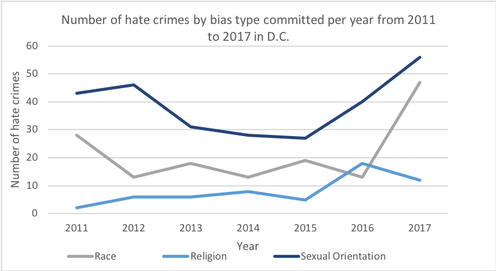
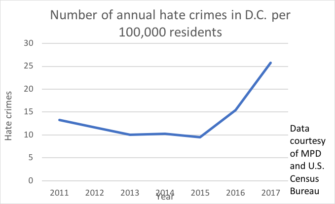
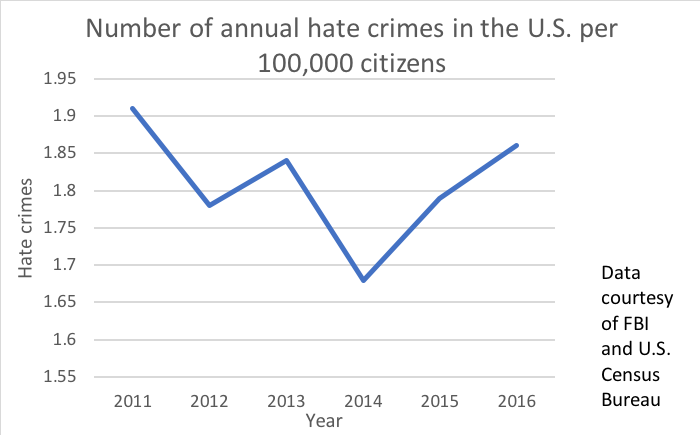

Two men were beaten in the U Street area downtown in an attack on April 15, which is suspected to be a sexual orientation-based hate crime and just one of several that have occurred so far this year, according to Metropolitan Police Department.

Despite an overall decline in citywide crime rates in the last year, hate crimes increased nearly 70 percent between 2016 and 2017. Authorities say that multiple variables are responsible for the spike.

“These may be crimes that have been occurring throughout time, but we are now doing a better job of getting people to report, getting our officers to recognize them and, quite honestly, classifying our reports properly,” said Brett Parson, lieutenant and commanding officer for the MPD’s Special Liaison Branch.

MPD defines a hate crime as a motive for a crime which demonstrates an accused person’s prejudice against a victim based off perceived or actual factors, such as race or religion. 

According to MPD [data](https://mpdc.dc.gov/page/bias-related-crimes-hate-crimes-data), the number of hate crimes committed based off of race and sexual orientation, among others, increased the most between 2016 and 2017, with the number of sexual orientation-based crimes rising 40 percent. Sexual orientation-based hate crimes accounted for nearly one-third of total hate crimes in 2017.

In looking at national hate crime data provided by the FBI, 2016 brought the highest number of hate crimes the nation had seen in five years, with more than 6,000 total biased-related crimes.
While national hate crime rates alternated between decreasing and increasing from 2011 to 2014, there was a spike from 2014 to 2015, which has continued through the most recent FBI data.

D.C. saw nearly an identical trend, beginning with an uptick in hate crimes starting in 2015 and continuing through 2017, with more than double the number of biased-related crimes in 2017 than in the years 2012 to 2015, respectively. 

In 2016, there were more than 25 hate crimes per 100,000 residents in D.C.,
according to data from MPD and the U.S. Census Bureau.

Recent national data, according to the FBI, shows an upward trend in overall hate crimes despite years of back and forth decreasing and increasing at the beginning of the decade.

“We respond to bias-related crimes in the District with a robust response,” said Parson. 

With regards to the most recent LGBT hate crime in the U Street area, Parson said that the lead detective is still investigating the case. He said that community involvement will be vital in solving this case, like many other biased-related crimes in D.C., as recent video [footage](https://www.washingtonpost.com/local/public-safety/video-is-released-in-assault-seen-as-potential-hate-crime/2018/04/16/0217fd3c-41c7-11e8-bba2-0976a82b05a2_story.html?utm_term=.57895729bfa6) of the assault released by MPD shows many civilians in the area at the time of the attack.

“That means that community members are going to be the key to solving this case,” he said, “Because someone was there that has information or someone knows someone that was there that can encourage them to come forward.”

## Help from the community, for the community

The D.C. Anti-Violence Project (DC AVP), a volunteer-based [organization](http://www.thedccenter.org/programs_dcavp.html), aims to reduce violence against members of the LGBT community through advocacy, survivor support and encouraging victims to report hate crimes committed against them.

According to Stephania Mahdi, 38, co-chair of DC AVP, there has been more activism through the organization. She said that #MeToo and other national movements have created a platform where activism against general LGBT bias is more widespread.

“We’re seeing more awareness toward more marginalized groups that are getting a voice,” said Mahdi.

Shannon Quinn, 23, is a communications coordinator for DC AVP. She said that she has noticed an increase in tension across the city since the 2016 election.

“Every day is stressful and kind of fearful for a lot of people,” said Quinn with regards to the recent uptick in hate crimes in D.C.

Since bringing on a full-time social worker, Mahdi said that there have been more members of the LGBT community seeking support and resources from DC AVP.

Parson said that MPD is taking steps to improve relations between law enforcement and members of the community too.

The purpose of liaison units, such as the LGBT Liaison Unit, is to give support to communities who are underserved and lack a strong relationship with law enforcement. The units are made up of officers who are members and allies of the respective communities they serve.

“The real concept behind the liaison units is a different way of engaging and building relationships with the citizens that live, work and visit the District of Columbia,” said Parson.

## 2018 bias-related crime projections

According to 2018 hate crime data as of March 31, bias related incidents based on sexual orientation, race and gender identity and expression are all up. The year-to-date data shows that race related hate crimes have doubled, gender identity and expression-based crimes are up eight from five and sexual orientation-based crimes have increased by two in the 2018 year-to-date numbers.

Parson said that he believes that various changes over the last several years have contributed to the department’s ability to properly handle bias related-crimes and getting them reported properly.

“We reviewed our general orders and policies, we discussed how to ask questions, we discussed how to actually fill out the report,” said Parson.

He said that in order to determine whether the number of hate crimes is truly increasing, MPD can only look at the data and anecdotal information they have at hand.

“We don’t know what the true answer is, because there’s not been really any scientific research into this,” said Parson.

