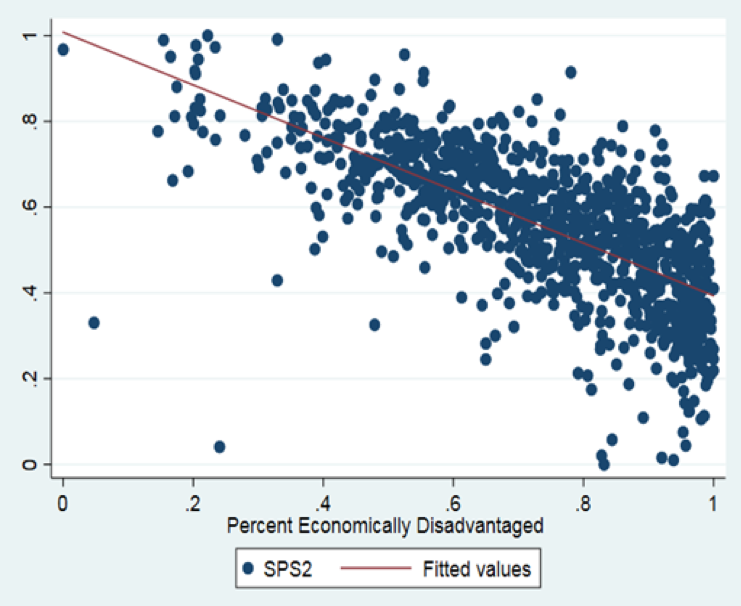
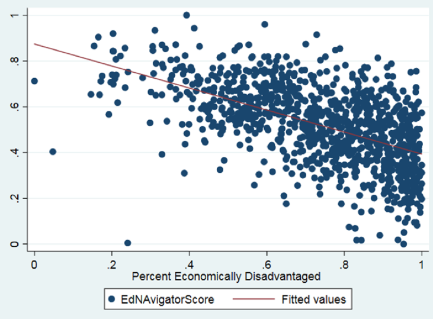

Elizabeth Guillen, Junior at American University states “if schools scores are low, it is highly likely that the charter school will be failing and forced to close”(Guillen, 2018). She sits across from me contemplating and sharing her experiences working with New Orleans schools. She highlights several challenges for New Orleans students- including busing, application process, and teacher hiring practices. She discusses the “inequities in schools” with passion. She is a student, who has studied and gone on an alternative break to New Orleans. Although she is a student and not a native of Louisiana, she is writing her capstone on educational equity and states the alternative break was “extremely eye opening”. But her note on accountability rings strongly- what happens to students when schools fail? What happens to students when scores change?

Schools like those in Elizabeth’s story are rated according to several factors, depending on the system they use.  The scores can be composed of things such as test scores, student achievement, or other important factors. For years, Louisiana has been at the bottom of the barrel of school accountability scores compared to other states in the United States.  However, a new change in their rating system policies might show improvements on the horizon.

In order to put themselves on a level playing field with other states in the US, Louisiana decided to adjust its school ranking system to a more rigorous one that is used more universally.   Unlike the previous policy, which focused mainly on standardized test scores, the gains-based system places more value on student academic growth. Academic growth refers to each student and schools’ progress in a given year.  According to a [local newspaper](http://www.theadvocate.com/baton_rouge/news/education/article_6a15a50c-0a5e-11e7-9f98-9797fe23bfe1.html.), the new system increased the percent that growth counts in a school’s rating from 7 percent to 25 percent of the overall score.  

This [same source](http://www.theadvocate.com/baton_rouge/news/education/article_6a15a50c-0a5e-11e7-9f98-9797fe23bfe1.html). points out that the system also raises the standards by which Louisiana schools are judged from “basic” to a more advanced “mastery” level.  By upping the difficulty of their rating criteria, they have the chance to try to improve their educational quality to meet the rising standards.  Still, many citizens do not see this as a positive change in their communities. Scott Devillier, superintendent of the Zachary School District and influential member of the Superintendent’s Advisory Council, noted in an email that he was worried about a drop in scores.  Cade Brumley, president of the Superintendent’s group, has also shared his concerns with  [local newspaper The Advocate](http://www.theadvocate.com/baton_rouge/news/education/article_6a15a50c-0a5e-11e7-9f98-9797fe23bfe1.html). that he expected that the number of schools “with an A rating will drastically fall and the number of F rated schools will substantially increase”. The reason for this, [former student Breanna Smith](http://www.lsunow.com/daily/opinion-assessment-accountability-changes-are-too-often-to-meas%20%20ure-success/article_b78c6cd0-d2d1-11e7-8f30-6b349f46909a.html) says, is because the changes are happening too quickly and teachers do not have the proper amount of time to adjust.  Reservations aside, the success or failure of the new program can only be assessed once the program has had time to produce results.

On paper, the new system Louisiana began using in 2017 would improve their current standings.  However, data is needed to fully assess the failure or success of the new program that was implemented.  By comparing data collected that examines the percentage of “at-risk” children in a school to their Ed Navigator school accountability score, the new program can be evaluated.  

The first graph shows a scatterplot of the data representing the scores for Louisiana schools under the old aggregate system.  There is a negative relationship, showing that the more economically disadvantaged children who are at a school, the worse their overall school accountability score is.  

The second graph shows the same thing, this time showing the school’s accountability score under the new gains-based system.  Once again there is a negative relationship, where the more economically disadvantaged kids go to a school the worse the school’s rating is. However, looking at the difference in the relationships, the second graph shows improvement from the former.  Scores for schools who have higher concentrations of economically disadvantaged kids are higher here than before. Low-income students are jeopardized in school systems that do not account for gains. When we move towards gains-based models, low income students have more room to grow and succeed.  While the difference is not much, the impact that even a small difference in slope can make is profound, which points to the overall success of the new program. 

This relationship becomes even more clear when you explore this map. Click on this map and you can explore specific schools. One school is Cecil Picard elementary school. Cecil Picard has a rate of 50% socioeconomically disadvantaged students. In the old system, their score is a 107, in the new adjusted system a 215. When these scores go up they make a difference:   
<iframe width="100%" height="520" frameborder="0" src="https://lascencio.carto.com/builder/c8976366-0042-4d2f-9795-aebc95a25f3b/embed" allowfullscreen webkitallowfullscreen mozallowfullscreen oallowfullscreen msallowfullscreen></iframe>. 
<iframe width="100%" height="520" frameborder="0" src="https://lascencio.carto.com/builder/ef0f2d88-56d8-41ab-bedb-1ef709df36ed/embed" allowfullscreen webkitallowfullscreen mozallowfullscreen oallowfullscreen msallowfullscreen></iframe>. 

School accountability scores have had a historic impact the future success of children.  The No Child Left Behind Act of 2002 mandates that federal funding be doled out according to the accountability scores of schools .  The argument here, as told by the [Federal Reserve of St. Louis](https://www.stlouisfed.org/publications/regional-economist/april-2004/tough-lesson-more-mone%20%20y-doesnt-help-schools-accountability-does), is that this will incentivize schools to be competitive and ensure that children are actually learning in order to get funding that helps the school as a whole.  

Getting this funding is important to the future success of their students.  A study done by Northwestern University shows several positive takeaways from getting more school funding.  One positive outcome of getting federal funding is that graduation rates increase for every 10 percent more that schools are able to spend per student.  A second point the study made was that spending an additional 10 percent per student in schools has been linked to increased earning potential of students once they transition into adulthood. Adults who experience this increase in school funding on average earn 7 percent more and are 3 percent less likely to experience poverty. 

Low-income students benefit the most from these outcomes, [Northwestern University’s study](https://www.ipr.northwestern.edu/publications/policy-briefs/school-spending-policy-research-brief-Jackson.pdf) suggests.  They can earn up to 13 percent more and their families over time can increase their earning potential by 17 percent.  This means that not only are the immediate outcomes beneficial to students, but the funding received as a result of the school accountability rating system can influence individual outcomes in the future.  

 One other thing to consider is that when schools have better ratings, better teachers soon follow.  In a [2014 study](https://www.washingtonpost.com/news/education/wp/2015/09/01/new-analysis-argues-that-better-teachers-are-flocking-to-better-schools/?utm_term=.10ecc2a2733e) of New York public schools, researchers found that teachers with better ratings tended to be attracted to schools who were improving their scores or already had higher scores.  This means that schools with lower ratings risk not having a good teaching staff to help children succeed in school.

Schools are not just places children benefit from in the future.  For some low-income students in particular, school is a place to get away from the issues they are facing in their home lives.  In a [case study](http://scholarworks.sjsu.edu/cgi/viewcontent.cgi?article=8150&context=etd_theses) about the success stories of low-income students across the country, a student referred to as Jen talks about how “school was [her] sanctuary”, which allowed her to build confidence in her abilities and gave her the tools to succeed in the future, despite the struggles she faced at home.  Making sure schools like Jen’s have funding is important to making sure students have an alternative environment in which to grow and get a break from what they are experiencing in their personal lives.  Without this, their outcomes might not be as positive down the road.  

Therefore, the changes in the Louisiana school rating system to try to improve their scores and the ability of students to succeed also gives them a better chance of securing better faculty.  Better teachers can then facilitate better scores from students because they are learning in a better environment, which could attract more qualified teachers. This cycle is one way that changing the school rating system can benefit the children in the Louisiana school system.  

 Overall, the changes made to the Louisiana school accountability rating system have allowed students the opportunity to see their education improve, which will benefit them later in life.  More importantly, low-income students who did not perform as well under the old system are able to improve under the new gains-based system. Louisiana schools are looking up, and because of their strides made in education, so are the futures of the children they educate.  
 

