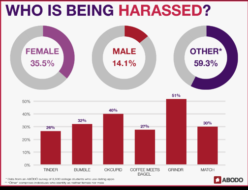
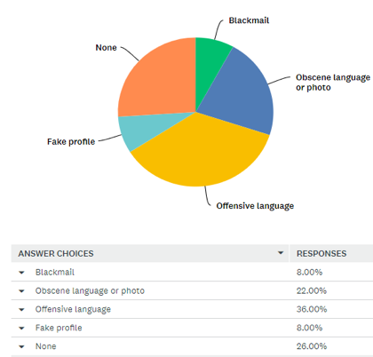
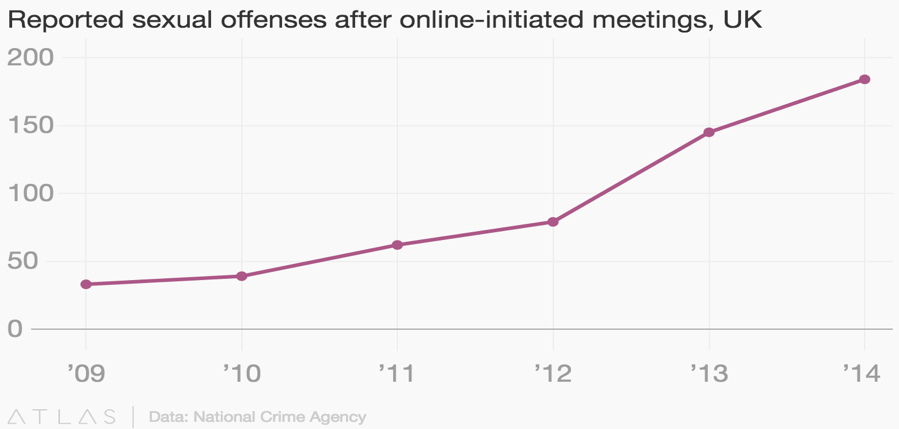
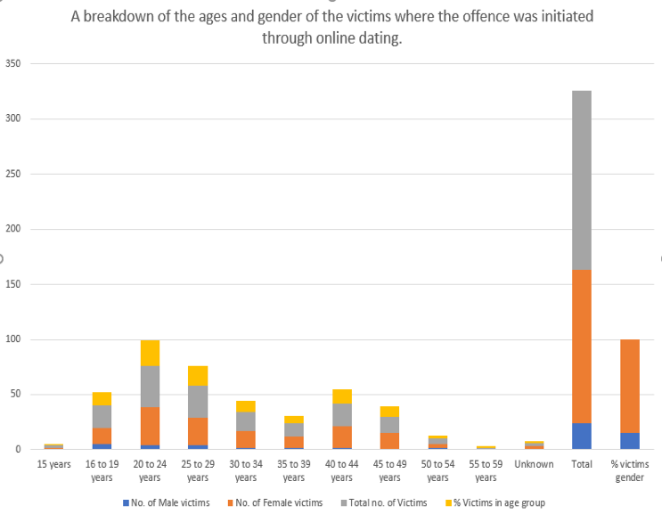

About 2 decades ago, when online-dating just came out in 1995, no one had ever thought of how popular online-dating would become, nor did they know how dangerous it could be. Nowadays, more singles are starting to date or hook up by using online-dating apps, such as Tinder and Grindr. However, more and more horrifying crimes had been linked to online-dating app usages in recent years, like being killed by their Tinder dates when meeting offline.

As one of the most popular online-dating apps, Tinder was initially released in 2012, which was around 5 years ago. By 2014, Tinder, the first “swiping apps”, whose users employ a swiping motion to choose photos of users, was registering about one billion “swipes” per day. 

According to research from Eharmony.com, 40 percent of Americans use online-dating, and men make up 52.4 percent of online-dating users in comparison to the rest 47.6 percent who are women. A survey by global research agency shows that 20 percent of women admitted to using an older photo from when they were younger and thinner, while 40 percent of men said they lied about their jobs in an effort to sound more successful. With such a high percentage of fake information, it is hard to tell who whose online strangers really are, and how to protect our safety and privacy, while also be able to communicate and interact with other interesting dates.

Sydney Loofe, 24, met Balley Boswell on Tinder and was excited for her first date with Boswell on November 15, 2017 and posted photos after her getting ready on snapchat with the caption, “Ready for my date.”. She was found missing the second day after her date. Half a month later, Loofe’s body was found in a rural area, dismembered. This is a very recent crime case that is related to Tinder usage, but this is not the only case that happened. 

Francia Ruth Ibarra was killed by her tinder date, Bocangegra, and her body was dissolved in acid. Before she was murdered by Bocangegra, they had actually gone on several dates. The police believed that Ibarra maybe have turned down Bocangegra’s sexual advance, which may lead to his later cruel murdering. 

There is no study showing that the app itself leads to any sort of abuse. However the app users were exposed more to people who are sexually coercive. At the same time the open online environment could lull users into assuming they know someone they met on the app after some conversations, therefore making themselves more unprotected and vulnerable. 

According to a survey conducted by ABODO.com about how 3500 college students are using dating apps, there are some very interesting data. Only 4 percent of participants prefer to use apps to meet potential dates and 27 percent had reported been harassed on APPS. While 35.5 percent of female participants and 14.1 percent of male participants said they had been harassed.

In order to find out if t¬¬here are any unpleasant experience they have ever had when using Tinder, 100 students in American University had answered the survey. When analyzing the data collected from the survey, an interesting finding that was shown in the survey implies that 4 percent of the participants has been blackmailed by their Tinder dates, 22 percent had received obscene languages or photos, 35 percent had experienced offensive languages and 8 percent has found mismatches in their date’s profile after meeting offline.   

## Unpleasant Tinder experiences among American University students 

The Pew Research center found that between 2008 to 2013, the proportion of American adults using dating service tripled. In Britain, the reported crimes and attacks related to online dating increased 6 times over 2009 to 2014, which was about the same period. If US and UK are experiencing the similar trends, dating APPs users should be more cautious about the hidden danger behind the screen. A report from National Crime Agency showed that 85 percentage of victims are females and victims from 20 to 24 and 25 to 29 have the highest numbers of been attacked. These numbers are serious warnings to online dating APPs users that they should be more careful about their online dates. 

Nathaniel Worthman, a freshman student working part time at CLEAR center in American University said that, “I never really had any awful experiences. I met some pretty great people on Tinder,” when asking about how he thought of Tinder, “I think it’s good because you get to meet a lot of people that you wouldn't typically get to meet in daily life. I feel like my life been a lot better because I’ve meet more different kinds of people.” However, there are also some students that have negative impression to Tinder.

“A lot of people on ‘hook-up apps’ such as Tinder and Bumble will pretend to be ‘single and is ready to mingle’, and what they really want to do is to hook up,” said Lauren Monahan, a freshman student in American University, “Another thing is, a lot of them are already in couple, so they have a boyfriend or girlfriend already and they are actually cheating on them.” Monahan said that she has heard of these a lot from her friends and that is the major reason that she knew about why people lied in Tinder. 

“For me, I don’t really go on for the hooking up aspect, I usually just talk to people and never do anything. A big turnoff for me is if they all look very good, and you swipe up to read their profile and they have nothing there, and you’re like ‘this is just a guy who wants to hook-up, swipe left.’ “said Monahan on how she found out what kind of profile she should not trust when using Tinder.

Chenhui Xu, a sophomore student in American University said that he has experienced mismatches on profile pictures when meeting up with the girls he knew from Tinder. “When I met them, I just realized how big the differences are between their pictures and their real persons. I have a lot of friend who heavily photoshopped their profile pictures on Tinder, so I have lost my trust in those profile pictures that I have seen on Tinder.”

As the development of the technology, the internet continues to mold the global culture of romance, and users should be much more careful when using these app. Not only the users should protect their privacy and safety more, the industry should fight with the dark side of online-dating and provide more armor against it in order to create a more peaceful and harmonious environment. 

