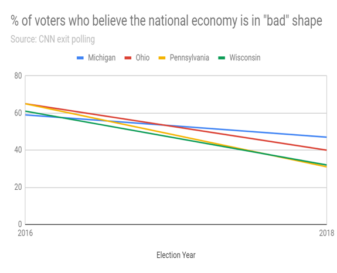
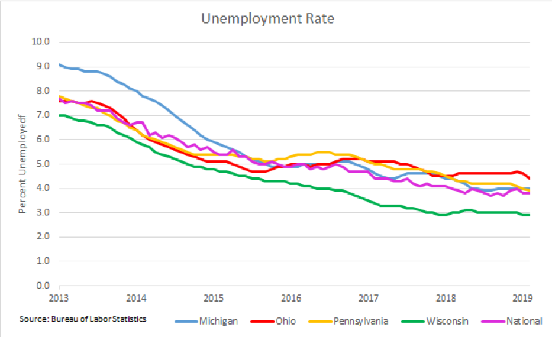

For years, the Democratic “Blue Wall” of the rust belt seemed impenetrable, but after Donald Trump’s shocking victory in the 2016 Presidential Election many were left wondering how this ruptured. How did Trump flip these states and resonate with that region in ways his Republican counterparts largely could not?

Let’s break it down. This “Blue Wall” is best defined as the Midwestern U.S. States and the District of Columbia that the Democratic Party traditionally won in Presidential elections from the years 1992 and 2012. Previously, this gave the Democratic party an advantage in the electoral college. 

In 2016, however, Donald Trump dismantled this with promises of economic stability and job opportunity, among other strategies.

When the time came for the election three years ago, voters in the Midwest were losing labor jobs at a rapid speed. And more than that, this downward slope is chronic and stagnant. Not much has been done in the past to revive this once boisterous and booming area as they have mainly been suffering from the lack of recent economic policy implementation that would benefit them directly. 

Basically, the rust belt has been given this name for a reason. It used to be the largest industrial center in the United States. In the 30 years since the beginning of its decline, though, all of those manufacturing outposts that originated here and brought much success to the area have left. Now, the interior of our country is deteriorating, both literally through the rotting of industrial infrastructure and figuratively as the economy present continues to decay.  

During their campaigns for presidency, both Donald Trump and Bernie Sanders appealed heavily to this specific group of westerners living and residing in the Midwest. 

A senior studying political science at American University in Washington D.C., AJ Pentaleri, explained this phenomena. He said, “Sanders used his platform to blame the business owners who have no remorse for their employees. They generally only care about profit and capitalizing the amount of money that they can produce.” So, when they decide to move a company out of the U.S., all of these people are out of their job.

But Sanders didn’t get the nomination. 

In large part, this is how Trump took the majority of electoral college votes. Pentaleri added that compared to Hillary Clinton, who basically said that jobs like coal mining were no longer necessary in America and didn’t focus enough energy on Wisconsin, Michigan, Ohio, and Pennsylvania, Donald Trump’s message was appealing. 

Specifically, Trump paved his way to the White House in 2016 strategically by focusing on these people who were otherwise considered deplorable. 

“He offered them a scapegoat for their continued suffering that was neither the government nor their wealth ridden bosses.” said Pentaleri. Instead, Trump acknowledged that someone out there was taking their jobs away from them.

In this scenario, Pentaleri said, it is the immigrants who work more hours a day for less money, and those in the developing country that big businesses moved to on their own autonomy because manufacturing there is cheaper and has fewer regulations.

By 2018, after two years of Trump being office, we are presented with yet another shift in the rust belt. 

<iframe title="Change between Trump 2016 percentage and 2019 approval" aria-label="USA states choropleth map" id="datawrapper-chart-k3NEh" src="//datawrapper.dwcdn.net/k3NEh/1/" scrolling="no" frameborder="0" style="width: 0; min-width: 100% !important;" height="400"></iframe>

According to the Federal Election Commission and Morning Consult, voters in the rust belt largely thought the economy improved since 2016, but either did not attribute it to Trump or it didn’t matter.
Trump promised to bring back tons of jobs to this area for manufacturing, but this never actually happened and still, he didn’t do much of anything to actually help them. 

“In 2018 the election was less national...and state representatives generally know more about state issues than their national counterparts.” said Andrew Ballard, a Political Science professor at American University. He is an expert on American politics and is particularly interested in voting behavior. 

Ballard continued, “their [state representative] campaigns are more direct and policy initiatives are geared towards the actual people that are affected by such change.” He also explained that it soon became readily apparent as the primaries progressed that Democratic candidates knew more about issues surrounding the rust belt and organized labor than the Republicans they were running against.

<iframe title="Percent GDP Growth in 2018" aria-label="USA states choropleth map" id="datawrapper-chart-yCISb" src="//datawrapper.dwcdn.net/yCISb/1/" scrolling="no" frameborder="0" style="width: 0; min-width: 100% !important;" height="430"></iframe>

It is not shocking to see from these graphs that Midwestern GDP growth has lagged behind much of the country, even during the middle of Trump’s presidency in 2018. 

With a new presidential election approaching in 2020, there is another opportunity for the Midwest to go against the tide. This time, they can decide to either remain red and basically guarantee Trump's second term, or voters can bring the region back to blue. 

The latter looks more promising. 

The Green New Deal is an initiative proposed by Democrats and led by representative Alexandria Ocasio-Cortez that aims to transform the greying economy into a sustainable one that is, according to the definition on the Green Party's official website, “environmentally sound, economically viable, and socially responsible.” Its goal is basically to address climate issues with implementing cleaner energy while also increasing wages, fairness, and economic opportunity. This policy change leans toward a democratic shift once again in the Midwest and brings forth a more advantageous and economically sound future. 
Along the same token, Bernie Sanders has decided yet again to run for the presidency. According to recent polls concerning his Town Halls, much support for his movement lies in the Midwest. He hopes to take back this area with his platform of policies like Medicare For All, taxing the rich, and offering free college tuition to all Americans. 

These ambitions economic policies brought forward by Democrats, in addition to the slower than expected economic growth in the Midwest, lends itself to the real possibility of a party turnover in 2020 that is in favor of a renewal of the Midwestern “Blue Wall” and the overall success of the Democratic ticket, resulting in Presidency. 

